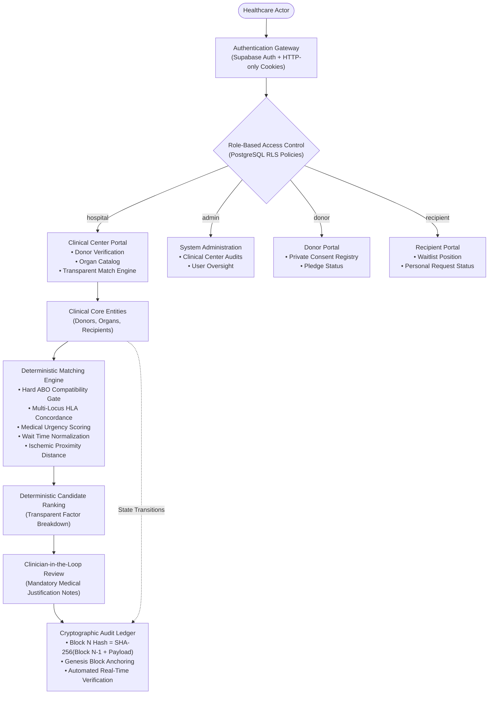

# OrganLink — Healthcare Registry & Transparent Matching Platform

> **A Secure, Transparent, and Auditable Organ Transplantation Management Architecture Inspired by Blockchain Healthcare Research**
>
> **Developed by [Debashish Bordoloi](https://www.linkedin.com/in/debashishbordoloi/)**  
> **Live Production System:** [https://organ-link-seven.vercel.app](https://organ-link-seven.vercel.app) • **GitHub:** [https://github.com/d4shhx0r/OrganLink](https://github.com/d4shhx0r/OrganLink)

---

> [!IMPORTANT]
> ### Mandatory Academic / Research Disclaimer
> **OrganLink is an academic and research prototype developed as a proof-of-concept for transparent healthcare systems.**  
> It is strictly designed as a **Clinical Decision Support System (CDSS)** and must **not** be used as an autonomous clinical transplant allocation system. The matching model, scoring criteria, and weight configurations are research-design choices and do not supersede legally established organ procurement and allocation frameworks (such as UNOS/OPTN in the United States, Eurotransplant in Europe, or NOTTO in India). The platform does not make autonomous allocation decisions and does not replace medical judgment.

---

## 1. Executive Summary & Core Objective

Organ transplantation is among the most logistically intricate and ethically sensitive domains in modern healthcare. Globally, thousands of patients lose their lives each year waiting for compatible organs, while organ procurement organizations face persistent challenges around public trust, operational opacity, and allegations of systemic favoritism or allocation manipulation.

**OrganLink** was designed to solve this trust deficit. Inspired by recent computer science research exploring distributed ledgers in healthcare, OrganLink investigates whether the core benefits promised by blockchain technology—**uncompromising transparency, algorithmic accountability, and mathematical tamper-evidence**—can be delivered using an enterprise-grade, privacy-compliant **secure web architecture**.

By uniting **Next.js 14 App Router**, **TypeScript**, **PostgreSQL Row Level Security (RLS)**, a **deterministic multi-factor matching engine**, and a **SHA-256 sequential cryptographic hash chain**, OrganLink creates a verifiable chain-of-custody for every event in the organ donation lifecycle—without the severe latency, financial gas costs, and HIPAA/GDPR compliance risks inherent to public blockchains.

---

## 2. Research Context: Blockchain vs. Cryptographic Web Architecture

OrganLink is conceptually grounded in the functional framework outlined in the academic research paper:
> *"An Implementation Perspective of Blockchain Technology in Leveraging Organ Donation in a Transparent Mode to both Patients and Donors"*

While the original paper explored deploying private Ethereum smart contracts and Solidity on a consortium blockchain, OrganLink implements a deliberate alternative: **Conventional Cryptographic Web Engineering**.

### Comparative Architectural Analysis

| Evaluation Metric | Blockchain / Smart Contract Approach | OrganLink Cryptographic Web Architecture |
| :--- | :--- | :--- |
| **Patient Privacy & Compliance** | Highly problematic. Public or consortium ledgers are immutable, conflicting directly with **HIPAA**, **GDPR "Right to be Forgotten"**, and medical privacy mandates. | **Compliant by Design**: Protected Health Information (PHI) is isolated within PostgreSQL protected by granular Row Level Security (RLS). Only non-identifying cryptographic state hashes are written to the audit chain. |
| **Auditability & Tamper-Evidence** | Distributed consensus across network nodes; high operational and computational overhead. | **Mathematically Equivalent**: Sequential SHA-256 hash chaining where each block cryptographically embeds the preceding block's hash. Any database mutation instantly breaks the chain. |
| **Transaction Latency & Performance** | Slow block validation times (12 seconds to minutes), introducing dangerous delays in time-critical emergency transplantation windows. | **Sub-100ms Execution**: Instant server-action execution and database transactions optimized for real-time surgical coordination. |
| **Operational & Financial Cost** | Gas fees fluctuate; requires node infrastructure, network maintenance, and complex wallet management. | **Zero Gas Fees**: Runs entirely on standard cloud infrastructure with predictable, zero-fee database operations. |
| **User Experience & Identity** | Users must manage private keys, seed phrases, and Web3 browser extensions (e.g., MetaMask). | **Frictionless Enterprise UX**: Standard email/password and modern authentication with secure, HTTP-only cookie session management. |
| **Clinical Governance Boundary** | Risk of smart contracts enforcing rigid, autonomous, and irreversible allocation decisions. | **Human-in-the-Loop CDSS**: Algorithmic scoring provides transparent ranking recommendations, but a licensed clinician must supply mandatory written justifications before allocation. |

---

## 3. End-to-End System Architecture



---

## 4. Role-Based Access Control (RBAC) & Database Security

OrganLink enforces defense-in-depth security. Access permissions are verified at the application layer through Next.js middleware and server actions, and enforced at the database layer via **PostgreSQL Row Level Security (RLS)**.

### Access Matrix by Role

| System Role | Portal View | Clinical Capabilities | Security Boundaries & Data Isolation |
| :--- | :--- | :--- | :--- |
| **`hospital`** | Clinical Center | Registers donors, approves/rejects donor listings, catalogues harvested organs, executes matching runs, records clinician decisions. | Cannot alter cryptographic audit ledger blocks. Cannot escalate user roles. |
| **`admin`** | Administration | System-wide oversight, hospital verification, integrity auditor inspection, and platform monitoring. | Subject to the same immutable audit logging policies. |
| **`donor`** | Donor Portal | Registers organ donation pledges, views personal consent records, and updates non-clinical contact details. | **Strictly restricted** from viewing other patients, hospital clinical tools, and matching algorithms. Cannot approve themselves. |
| **`recipient`** | Recipient Portal | Monitors personal waiting list status, active organ request, and notification history. | **Strictly restricted** from viewing competitor recipient medical data or hospital management tools. |

### Row Level Security (RLS) Guarantees

1. **Insecure Direct Object Reference (IDOR) Protection:**
   Patients querying recipient or donor records can only retrieve rows matching `profile_id = auth.uid()`. Fabricating or modifying UUID parameters in HTTP requests returns `404 Not Found` directly from PostgreSQL.
2. **Role Escalation Prevention:**
   The `profiles` table allows users to update their personal information (e.g., name, phone), but database triggers and RLS policies prevent users from modifying their own `role` or `is_verified` status.
3. **Database-Level Immutability for Audit Records:**
   The `audit_logs` table has policies allowing `SELECT` and `INSERT`. It contains **zero `UPDATE` or `DELETE` policies**, guaranteeing that even privileged queries cannot modify past audit blocks.

---

## 5. Clinical Entities & Lifecycle Workflow

The clinical workflow within OrganLink mirrors the real-world operational phases of organ procurement organizations:

### 1. Donor Management & 2-Step Verification (`/app/donors`)
- Donors are registered with biological metrics: ABO Blood Group, Age, Hospital Facility, Geographic Coordinates, and structured **HLA Allele Markers**.
- Newly created donors enter the system with `approval_status: 'pending'`.
- To prevent fraudulent or unauthorized organ listings, an organ can only be cataloged after a verified clinical coordinator completes an eligibility review and marks the donor as **Approved**.

### 2. Organ Catalog & Cold Ischemic Preservation (`/app/organs`)
- Organs (Kidney, Liver, Heart, Lung, Pancreas) are linked to approved donors.
- Each organ records:
  - Harvest procurement timestamp
  - Maximum cold ischemic preservation threshold (the critical clinical window before tissue degradation)
  - Current preservation status (`available`, `allocated`, `transplanted`, `expired`)

### 3. Recipient Waitlist Management (`/app/recipients`)
- Patients requiring transplantation are cataloged with their required organ type, ABO blood group, HLA allele profile, and validated registration date.
- Each candidate is assigned a standardized medical urgency tier:
  - `status_1_critical`: Immediate life-threatening failure; intensive care hospitalization.
  - `status_2_urgent`: Rapidly deteriorating condition; continuous clinical intervention.
  - `routine`: Stable candidate managed through outpatient therapy.

---

## 6. Tissue Typing & Immunogenetics (HLA Alleles)

In organ transplantation, matching blood group (ABO) is merely the initial baseline. The decisive immunological factor determining long-term graft survival is **Human Leukocyte Antigen (HLA) tissue typing**.

### What is HLA?
HLA markers are specialized proteins located on the surface of human cells that act as a biological identification barcode. The recipient's immune system continuously scans these markers:
- **High Compatibility:** The immune system recognizes the transplanted tissue as friendly, significantly reducing the probability of acute or chronic organ rejection.
- **Low Compatibility:** White blood cells identify the donor antigens as foreign, triggering an aggressive immune response that leads to graft failure.

### Genetic Loci Evaluated in OrganLink
OrganLink evaluates structured allele markers across 5 major genetic loci:
- **HLA-A** (e.g., `A*02`, `A*24`)
- **HLA-B** (e.g., `B*07`, `B*44`)
- **HLA-C** (e.g., `C*07`, `C*08`)
- **HLA-DRB1** (e.g., `DRB1*04`, `DRB1*15`)
- **HLA-DQB1** (e.g., `DQB1*02`, `DQB1*03`)

### Algorithmic Concordance Scoring
The tissue compatibility module (`lib/matching/tissue-compatibility.ts`) normalizes and compares loci strings between donor and candidate:

$$\text{Concordance Ratio} = \frac{|\text{Donor Loci} \cap \text{Recipient Loci}|}{\max(|\text{Donor Loci}|, |\text{Recipient Loci}|)}$$

| Match Category | Concordance Condition | Factor Score ($S_{\text{HLA}}$) | Clinical Meaning |
| :--- | :--- | :--- | :--- |
| **Exact Match** | 100% agreement on all recorded loci | **$1.00$** | Optimal immunological fit; lowest risk of rejection. |
| **Partial Match** | Subset of shared loci identified | **$0.30 - 0.85$** | Proportional score computed as $0.30 + 0.70 \times \text{Concordance}$. |
| **Mismatch** | Zero common alleles detected | **$0.05$** | High immunological risk; candidate deprioritized. |
| **Insufficient Data** | Incomplete or unrecorded loci | **$0.25$** | Research baseline score applied with an explicit clinical disclosure flag. |

---

## 7. The Deterministic Transparent Matching Engine

The core algorithmic component of OrganLink (`lib/matching/matching-engine.ts`) executes a deterministic, multi-factor scoring calculation. Given the exact same clinical dataset, it will produce identical rankings every time, preventing arbitrary deviations.

### The Composite Scoring Formula

$$\text{Composite Score} = 100 \times \left(w_{\text{HLA}} \cdot S_{\text{HLA}} + w_{\text{urgency}} \cdot S_{\text{urgency}} + w_{\text{wait}} \cdot S_{\text{wait}} + w_{\text{distance}} \cdot S_{\text{distance}}\right)$$

Where default research weights are configured as:
- $w_{\text{HLA}} = 0.35$ (Tissue compatibility)
- $w_{\text{urgency}} = 0.30$ (Medical urgency status)
- $w_{\text{wait}} = 0.20$ (Normalized waiting time)
- $w_{\text{distance}} = 0.15$ (Geographic proximity & transport preservation)

---

### Phase 1: Hard Exclusion Gates (Strict Clinical Disqualification)
Before mathematical scoring begins, candidates must clear strict categorical exclusions:
1. **Organ Type Match:** Candidate's `required_organ` must strictly match the available organ.
2. **Active Status:** Candidate must be marked as `active` on the waitlist.
3. **ABO Blood Group Compatibility:** Enforces universal biological rules:

| Donor Blood Group | Compatible Recipient Blood Groups | Incompatible Groups (Strict Disqualification) |
| :---: | :---: | :---: |
| **O** | O, A, B, AB *(Universal Donor)* | None |
| **A** | A, AB | B, O |
| **B** | B, AB | A, O |
| **AB** | AB *(Universal Recipient)* | O, A, B |

*Candidates failing any hard gate are categorized into `excludedCandidates` with clear, human-readable explanations.*

---

### Phase 2: Factor Scoring & Normalization
- **HLA Concordance ($S_{\text{HLA}}$):** Derived via the immunogenetic comparison engine ($0.05 - 1.00$).
- **Medical Urgency ($S_{\text{urgency}}$):**
  - `status_1_critical` $\rightarrow 1.00$
  - `status_2_urgent` $\rightarrow 0.70$
  - `routine` $\rightarrow 0.40$
- **Waiting Time Normalization ($S_{\text{wait}}$):**
  Linear scaling capped at 2 years (730 days):
  $$S_{\text{wait}} = \min\left(1.0, \frac{\text{Days on Waitlist}}{730}\right)$$
- **Geographic Proximity ($S_{\text{distance}}$):**
  Calculates approximate transport transit time to protect the organ's cold ischemic preservation limit. Shorter distances yield higher preservation scores ($0.20 - 1.00$).

---

### Phase 3: Deterministic Multi-Tier Tie-Breaking
If two candidates receive identical composite scores, ties are resolved deterministically through a cascading sequence:
1. **Medical Urgency Score** (higher urgency breaks the tie)
2. **Verified Waitlist Duration** (candidate waiting longer ranks higher)
3. **Recipient Alphanumeric Reference** (deterministic string sort ASC as a final immutable tie-breaker)

---

## 8. Human-in-the-Loop Clinical Governance

A foundational premise of OrganLink is that **algorithms must advise, not decide**.

OrganLink enforces a strict boundary between algorithmic ranking and allocation execution:
1. The matching engine generates an explainable ranking showing exactly how each candidate scored across every biological factor.
2. The clinical coordinator reviews the transparency breakdown.
3. To confirm an allocation, the clinician must select an outcome and **input mandatory medical justification notes**.
4. Both the algorithm's raw recommendation and the clinician's written justification are permanently sealed into the cryptographic audit trail.

---

## 9. Cryptographic SHA-256 Audit Ledger

To deliver the provenance and anti-tampering guarantees of blockchain without its performance overhead, OrganLink utilizes a **sequential SHA-256 cryptographic hash chain** (`lib/audit/audit-service.ts`).

### The Mathematical Block Model

Every critical action (User Registration, Donor Approval, Organ Procurement, Matching Execution, Clinician Review) generates a block:

$$\text{Block Hash}_N = \text{SHA-256}\left(\text{Hash}_{N-1} \,\|\, \text{Action} \,\|\, \text{Actor ID} \,\|\, \text{Entity ID} \,\|\, \text{Payload JSON} \,\|\, \text{Timestamp}\right)$$

```
┌─────────────────────────┐       ┌─────────────────────────┐       ┌─────────────────────────┐
│         BLOCK 0         │       │         BLOCK 1         │       │         BLOCK 2         │
│      Genesis Block      │       │    DONOR_REGISTERED     │       │     DONOR_APPROVED      │
├─────────────────────────┤       ├─────────────────────────┤       ├─────────────────────────┤
│ Prev: 00000000000000... │◄──────│ Prev: Hash(Block 0)     │◄──────│ Prev: Hash(Block 1)     │
│ Hash: 8f3a9e1b2c4d...   │       │ Hash: 4e7d1a9c3f2b...   │       │ Hash: 9b2c8f1e4a7d...   │
└─────────────────────────┘       └─────────────────────────┘       └─────────────────────────┘
```

### Tamper-Evidence Guarantees
- **Continuous Pointer Integrity:** Every block points explicitly to the hash of the block before it.
- **Content Sensitivity:** Because SHA-256 is collision-resistant and avalanche-sensitive, altering even a single character in a patient's historical urgency score or timestamp changes that block's hash completely.
- **Cascade Invalidation:** Changing past data breaks the linkage for every subsequent block in the chain.
- **Real-Time Verification:** The platform includes an automated integrity auditor (`verifyRecordsIntegrity`) that recomputes every hash in sequence and highlights any discrepancy in the audit dashboard (`/app/audit`).

---

## 10. Automated Verification & Testing Suite

OrganLink is accompanied by a suite of **62 automated tests** verifying every layer of the architecture:

```bash
# Execute the full automated test suite
npm test
```

### Test Suite Structure

1. **Cryptographic Audit Chain Integrity (`tests/audit-chain.test.ts`)**
   - Validates Genesis block initialization and continuous hash linkage.
   - Tests tamper detection against:
     - Modified payload contents
     - Broken `previous_hash` pointers
     - Unauthorized state modifications
     - Retroactively altered timestamps and backdating
2. **Deterministic Matching Engine Regression (`tests/matching-engine.test.ts`)**
   - Validates the complete ABO compatibility matrix (universal donors and recipients).
   - Validates multi-locus HLA tissue typing concordance scoring.
   - Verifies medical urgency scaling and waiting time normalization.
   - Validates 100% deterministic reproducibility across repeated runs.
   - Tests multi-tier tie-breaking and missing clinical data resilience.
3. **End-to-End Synthetic Clinical Workflow (`tests/e2e-workflow.test.ts`)**
   - Simulates a full lifecycle: Donor registration $\rightarrow$ Clinical approval $\rightarrow$ Organ listing $\rightarrow$ Patient registration $\rightarrow$ Algorithmic matching run $\rightarrow$ Clinician review $\rightarrow$ 7-block cryptographic audit ledger verification.

---

## 11. Technology Stack

| Layer | Technologies | Purpose |
| :--- | :--- | :--- |
| **Frontend Framework** | Next.js 14 (App Router), React 18, TypeScript | Server Components, Server Actions, responsive interface |
| **Styling & Animation** | Tailwind CSS, Framer Motion, Lucide Icons | Clean, high-contrast, accessible healthcare UI |
| **Database & Auth** | PostgreSQL, Supabase, `@supabase/ssr` | Relational data model, cookie-based sessions, Row Level Security |
| **Data Validation** | Zod | Runtime schema validation across client and server boundaries |
| **Cryptography** | Node.js `crypto` | Deterministic SHA-256 hash calculation and audit verification |
| **Testing** | TSX, Node Test Runner | Automated regression, unit, and end-to-end integration tests |

---

## 12. Author & Acknowledgments

OrganLink was architected and developed by **Debashish Bordoloi** as an advanced research prototype exploring modern cryptographic web architectures in healthcare delivery systems.

- **Author:** Debashish Bordoloi
- **Professional Profile:** [LinkedIn](https://www.linkedin.com/in/debashishbordoloi/)
- **Target Repository:** [https://github.com/d4shhx0r/OrganLink](https://github.com/d4shhx0r/OrganLink)
- **Live Deployment:** [https://organ-link-seven.vercel.app](https://organ-link-seven.vercel.app)

*Informed by academic research into transparent healthcare systems, ethical organ allocation, and cryptographic verification.*
